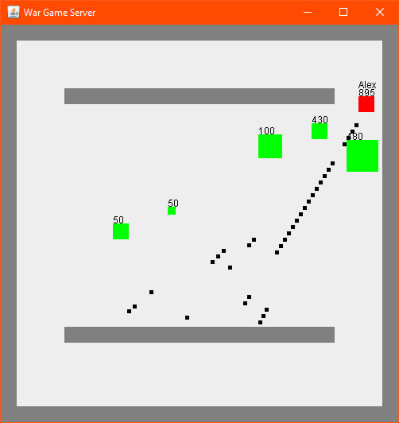
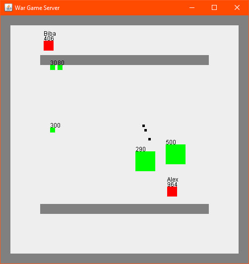

WarGame
=======

Описание
--------

WarGame - это шутер с видом сверху, в котором игрокам предстоит сражаться с зомби и противниками. Игра предлагает возможность игры по локальной сети, что позволяет вам сражаться вместе с друзьями или против них.

Авторы
------

*   Меньшиков Александр
*   Асбапов Рустам

Установка и запуск
------------------

1.  Клонируйте репозиторий на ваше устройство.
2.  Откройте терминал и перейдите в директорию проекта.
3.  Запустите игру, выполнив команду `java -jar WarGame.jar`.

Управление
----------

*   Используйте клавиши WASD для перемещения персонажа.
*   Нажмите левую кнопку мыши, чтобы стрелять в направлении указателя мыши.

Требования
----------

*   Java Runtime Environment (JRE) версии 18 или выше.
